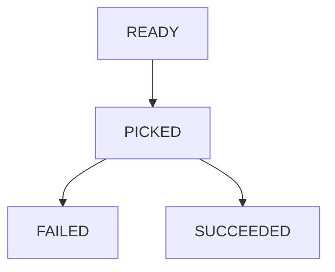

Job management is a small module to run and manage job.

Job management include 2 parts:
- 1: job runner when developers can add jobs (job directory) and job runner has a machenism to run job when having goroutine is available.
- 2: job watcher will watch and update status of jobs to make job ready to run.

statuses of job:



- Job (Ready) --> Job (Picked): job runner pick a job is ready from database and assign to goroutine is available
- Job (Picked) --> Job (Succeeded): job will be succeeded when done
- Job (Picked) --> Job (Failed): job will be failed when get error
- Job (Failed) --> Job (Ready): job watcher change status of job failed if executed_times < times
- Job (Picked) --> Job (Ready): job watcher change status of job picked if job run too slow (greater than ttl) and executed_times < times)

How to use use and integrate this library to your code.
```
  clone code
  add new job in job directory
  run 
```
